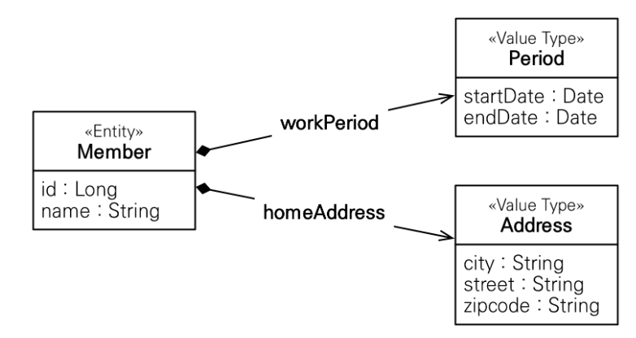
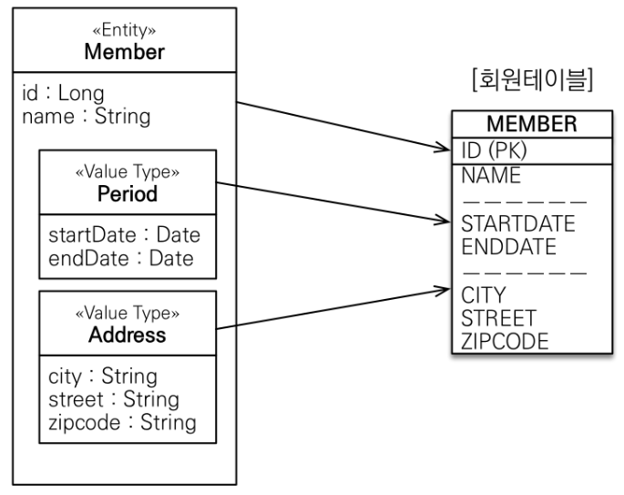

## 임베디드 타입(복합 값 타입)

- 새로운 값 타입을 직접 정의 할 수 있음

- 내장 타입

- 주로 기본 값 타입을 모아서 만들어 : 복합 값 타입

- int, String 과 같은 `값 타입`

- Entity가 아니다.

- 변경하면 추적이 안됨

## Member 엔티티

- 회원 엔티티에 name, startDate, endDate, city, street, zipcode 를 가진다.

- 뭔가 공통적인 속성들이 눈에 보인다.

- 근무 시작일-종료일,
- city, street, zipcode

- 이런 속성들은 묶어서 한번에 관리하면 좋겠다는 생각이 든다.
  

- 추상화 해서 설명해보면 `회원 엔티티는 이름, 근무 기간, 집 주소`를 가진다고 할 수 있다.

- 공통 속성을 묶어서 새로운 클래스로 묶어

## 임베디드 타입 사용법

- @Embeddable : 값 타입을 정의하는 곳에 표시

- @Embedded : 값 타입을 사용하는 곳에 표시

- 기본 생성자 필수

## 임베디드 타입의 장점

- 재사용성

- 높은 응집도

- Address, Period 같은

- Period.isWork() 같이 해당 값 타입만 사용하는 의미 있는 메서드를 만들 수 있음

- 임베디드 타입을 포함한 모든 `값 타입`은, 값 타입을 소유한 `엔티티에 생명 주기를 의존`한다.

## 임베디드 타입과 테이블 매핑



- DB 입장에선 Period, Address 값 타입을 쓰든 안쓰든 테이블이 똑같음

- 객체는 데이터 뿐만 아니라 행위, 기능(메서드) 도 구현이 중요하다.

```java
private LocalDateTime startDate
private LocalDateTime endDate;
```

이런 걸 다 Member class 엔티티에 넣고 돌리면 db에 잘 넣어 줄 수 있음

- 하지만 이런 걸 묶어 놓고 싶다.

- 공통으로 쓰고 싶은게 있다.

- 1. 일단 클래스를 만든다.

```java
private Period period;
```

- 2. class 위에 @Embeddable

- 3. 값 사용하는 변수 위에 @Embedded

- 이렇게 하면 JPA가 묶어 준다.

- 이렇게 해두면 Period 클래스 안에서 유용한 메서드들을 만들 수 있다.

## 임베디드 타입과 테이블 매핑

- 임베디드 타입은 엔티티의 값일 뿐이다.

- 임베디드 타입을 사용하든 안하든 매핑하는 테이블은 같다.

- 객체와 테이블을 아주 세밀하게 매핑할 수 있다.

- 추상화가 더 잘 되어있음

- 잘 설계한 ORM 애플리케이션은 매핑한 테이블의 수보다 클래스의 수가 더 많음

## 임베디드 타입과 연관관계

- 임베디드 타입은 임베디드 타입을 가질 수 있다.

- 임베디드 타입은 엔티티를 가질 수 있다.

## 한 엔티티 안에서 같은 임베디드 타입 여러개 사용하고 싶을 때

- 집 주소와 회사 주소 모두를 Address 타입으로 가지고 싶을 때

- DB 테이블에서 Address 안에 city, street, zipcode 컬럼 이름이 중복되어 충돌

- @AttributeOverrides

- @AttributeOverride

- 각각의 필드에 대해 DB 컬럼명을 다르게 지정할 수 있다.
