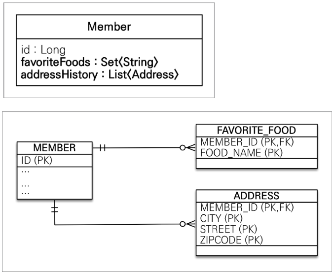

## 값 타입을 컬렉션에 담아서 쓰고 싶다.

- 엔티티를 컬렉션으로 쓴 적이 있음

- 값 타입 컬렉션 2개를 가진 Member 를 DB에 어떻게 넣어야 하나?

- Member 안에 favoriteFodds : Set<> 이나 addressHistory : List<> 같이 컬렉션이 들어있다면?

- 전통 DB는 하나의 필드 안에는 하나의 값이 들어가야 한다.

- 요즘 DB는 JSON 등을 지원하는 경우가 있긴 하지만 기본적으로는 별도의 테이블로 빼야 한다.
  

## 값 타입 컬렉션

- 값 타입을 하나 이상 저장하고 싶을 때

- 결국 List, Set 같은 컬렉션, 여러개의 값을 가져야 하는 필드가 있으면 별도의 테이블로 빼야 한다.

- 별도 테이블을 저장하는 구현을 JPA가 해준다.

- @ElementCollection, @CollectionTable

```java
@Entity
public class Member{

    ...

    @ElementCollection
    @CollectionTable(name = "FAVORITE_FOOD", joinColumns = @JoinColumn(name = "MEMBER_ID"))
    private Set<String> favoriteFoods = new HashSet<>();

    @ElementCollection
    @CollectionTable(name = "ADDRESS",  joinColumns = @JoinColumn(name = "MEMBER_ID"))
    private List<Address> addressHistory = new ArrayList<>();
}
```

## 사용

```java

Member member = new Member();
member.setUsername("member1");
member.setHomeAddress(new Address("city", ....));

member.getFavoriteFoods().add("치킨");
member.getFavoriteFoods().add("피자");
member.getFavoriteFoods().add("족발");

member.getAddressHistory().add(new Address("old"));
member.getAddressHistory().add(new Address("new"));

em.persist(member);
```

- 이렇게 구현하면 가장 먼저 member 테이블에 insert

- 2번째로 AddressHistory를 insert(2번)

- 3번째로 FavoriteFood insert (3번)

- 흥미로운 점 : 값 타입 컬렉션을 따로 persist 한게 아니다.
- 아예 다른 테이블임에도 불구하고 라이프 사이클이 같이 돌아간것

- `값 타입`이기 때문
- Member 안의 memberName 과 같은 취급을 받는다.
- 별도의 persist가 필요없음

## 값 타입 수정

- homeCity -> newCity로 city를 바꾸고 싶다.

- 하지만 setter가 없다. setCity() 같은게 없음

- 그렇다고 public 으로 값 타입을 바꿀 수도 없음

- findMember.setHomeAddress(new Address("newCity" ...)); 이렇게 새로운 인스턴스를 넣어줘야 한다.

- List/<String> 역시 값이 변경되지 않는 String 타입, remove()와 add() 직접 바꿔준다.

- 신기한건 객체에서 다루듯 remove, add 하면 DB에 쿼리가 날라간다는 것

## 값 타입 컬렉션의 제약 사항

- 엔티티와 다르게 식별자 개념이 없음

- 값을 변경하면 추적이 안된다.

- 값 타입 컬렉션에 변경사항 발생하면, 주인 엔티티와 연관된 모든 데이터 삭제하고, 값 타입 컬렉션에 있는 현재 값을 모두 다시 저장

- 값 타입 컬렉션을 매핑하는 테이블은 모든 컬럼을 묶어서 기본 키를 구성해야 한다.

## 대안

- 실무에선 값 타입 컬렉션 대신 일대다 관계 고려

- 일대다 관계를 위한 엔티티를 만들고, 그 엔티티에서 값 타입 사용

## 값 타입 언제 쓰나?

- 정말 단순할 때

- 사용자 옵션이 2개 일 때처럼 값이 단순하고 값이 바뀌어도 업데이트 칠 필요 없는 경우

- 왠만한 변경이 필요할만한, 이력이 남을만한 것들은 다 엔티티임

## 정리

- 엔티티 타입

  : 식별자

  생명 주기 관리

  공유

- 값 타입

  식별자 X

  생명주기를 엔티티에 의존한다.

### 식별자 필요하고, 지속적으로 값을 추적하고 변경할 필요가 있으면 값타입이 아니다.


