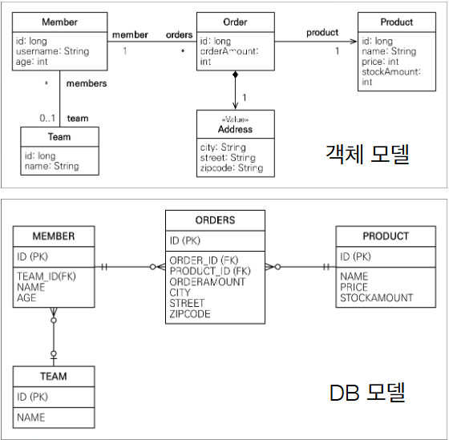

## JPQL

- Java Persistence Query Language

- 자바 영속성 쿼리 언어

## JPQL 문법



- SQL과 문법이 동일하다.

- Select

```
select
from
where
group by
having
orderby
```

`select m  from Member as m where m.age>18`

- 엔티티 속성은 대소문자 구분을 한다. (Member , age)
- JPQL 키워드는 대소문자 구분이 없음

- 엔티티 이름 사용, 클래스 이름이 아니다.(@Entity name = "MM" 이라고 했으면 MM에서 찾아야 함)

## TypeQuery, Query

- TypeQuery :반환 타입이 명확할 때 사용

- Query : 반환 타입이 명확하지 않을 때 사용

```java
em.createQuery( sqlString, Member.class)
```

이렇게 명확하게 타입 정보를 가져올 수 있으면 TypedQuery 쓰면 된다.

String.class 도 명확하게 가져올 수 있는 것

하지만 명확하지 않으면 (m.name, m.age 이렇게 가져오는 경우)
Query query = em.~ 로 가져올 수 있음

- `.getResultList()`를 통해 쿼리를 통해 가져온 값들을 list로 받을 수 있음, 결과 없으면 빈 리스트 반환

- 반드시 받아올 값이 하나인 경우 `.getSingleResult()` 로 받을 수 있긴하다.
  결과가 안나오면 NoResultException, 둘 이상이면 NotUniqueException 나온다.

- 스프링 Data JPA에서는 exception 터뜨리지 않고 null, optional을 반환해준다.

## 위치 기반 파라미터 바인딩

- 사실 위치 기반으론 안하는게 좋다.

- m.username = ?1
