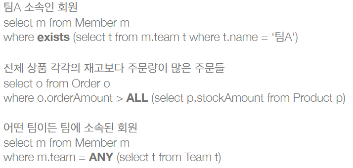

## 서브 쿼리

- 일반적 SQL에서말하는 서브쿼리랑 같은 거

- 평균 값을 select로 구해서 그 값을 사용한느 느낌

- 한 건이라도 주문한 고객

## 서브 쿼리 지원 함수

- EXIST : 서브 쿼리에 결과가 존재하면 참

- IN : 서브 쿼리의 결과 중 하나라도 같은 것이 있으면 참

## JPA 서브 쿼리의 한계

- SQL도 가지는 한계이다.

- WHERE, HAVING 절에서만 서브 쿼리를 사용할 수 있다.

- SELECT 절에서도 가능(하이버네이트)

- FROM절 서브 쿼리는 JPQL에서 불가능하다.

- 조인으로 풀 수 있으면 풀어서 해결할 수 있기는 하다.

- `Select mm.age, mm.username from (select m.age, m.username) as mm` 이런게 안된다.

