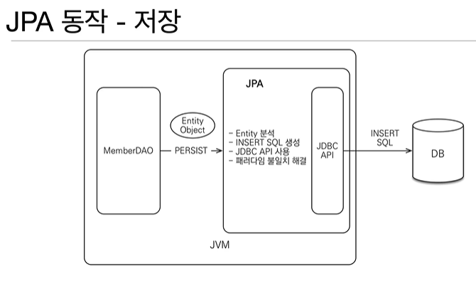
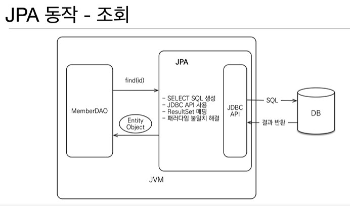

## ORM

- object relational mapping : 객체 관계 매핑

- 객체는 객체대로 설계

- 관계형 db는 관계형 db 대로 설계

- ORM 프레임워크가 중간에서 매핑

- 패러다임의 불일치를 해결해주겠다.

## JPA는 애플리케이션과 JDBC 사이에서 동작

- 원래는 개발자가 직접 JDBC 코드를 작성해서 DB와 통신(crud)

- 저장: JPA는 객체 Entity를 분석, Insert SQL 생성, JDBC API 실행, 패러다임 불일치 해결
  

- 조회: JPA는 Select SQL 생성, JDBC API 실행, ResultSet 매핑, 패러다임 불일치 해결
  

## JPA 소개

- EJB : 엔티티 빈(자바 표준), 옛날, 엔티티 빈은 쓰지 않음

- 하이버네이트(오픈 소스)

- 하이버네이트를 정제해서 JPA 자바 표준

## JPA는 표준 명세

- 인터페이스의 모음

- 3가지의 구현체 - 그중 대부분이 하이버네이트 사용

- 우리는 JPA 인터페이스의 하이버네이트 구현체를 사용한다고 생각하면 된다.

## JPA를 왜 사용해야 하나?

- SQL 중심적인 개발에서 객체 중심으로 개발

- 생산성

- 유지 보수

- 패러다임 불일치 핵ㄹ

## 생산성

- 저장 : jpa.persist(member) : 마치 자바 컬렉션에 저장하듯

- 조회 : Member member = jpa.find(memberID)

- 수정 : member.setName("변경할 이름")

- 삭제 : jpa.remove(member)

> 매우 간단해짐

## 유지보수

- 기존에 필드가 수정되면 모든 sql 돌면서 다 수정해야 함.

- 이젠 필드만 추가하면 됨

## JPA가 패러다임의 불일치 히결

1. 상속

   기존에는 부모-자식 관계가 있으면 두개 테이블에 넣어야 함

   jpa 쓰면 persist 가 알아서 처리한다.

   조회할 때도 find가 알아서 처리한다.

2. 연관관계, 객체 그래프 탐색

   이젠 엔티티, 계층을 신뢰할 수 있게 됨.

3. 비교하기

   jpa.find(~1213~) 와 jpa.find(~1213~) 가 jpa는 같다고 보장해준다

   약간의 조회 성능 향상

4. 성능 최적화

   중간에 단계가 끼기 때문에

   캐싱 가능해짐

   JDBC BATCH SQL 기능 이용하여 한번에 SQL 전송

   ```sql
   transaction.begin();

   em.persist(mA);
   em.persist(mB);
   em.persist(mC);
   ...
   ...

   transaction.commit();
   ```

## 지연 로딩, 즉시 로딩

- 지연 로딩 : 객체가 실제 사용될 때 로딩

- 즉시 로딩 : JOIN SQL로 한번에 연관된 객체까지 미리 조회

상황에 맞게, 객체를 사용할 때와 불러올 때를 관리할 수 있음.

- 보통 지연 로딩으로 구현해두고, 나중에 성능 최적화 할 때 즉시 로딩으로 바꾸면 좋다.

# ORM은 객체와 RDB 두 기둥 위에 있는 기술

- 객체와 관계형 데이터베이스 두개를 모두 잘 알고 매핑하는 게 중요
