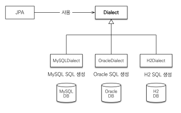

## JPA가 어떻게 동작하냐? - JPA 구동 방식

### persistence 라는 Class가 있음

- 이 Persistence 클래스가 META-INF/persistence.xml 을 읽어서 설정 정보를 조회한다.

- 읽은걸 바탕으로 EntityManagerFactory 생성

- EntityManagerFactory는 EntityManager를 찍어냄

### 실습

- JPA를 사용하기 위해서는 `pom.xml` 에 `hibernate`를 추가한다.

```xml
<dependency>
 <groupId>org.hibernate</groupId>
 <artifactId>hibernate-entitymanager</artifactId>
 <version>5.3.10.Final</version>
 </dependency>
```

- JPA를 설정하기 위해서 `resource/META-INF/persistence.xml` 설정파일을 만들어야 한다.

  - persistence-unit : 이름을 지정한다. 이 속성의 이름

  - javax.persistence로 시작 : JPA의 표준 속성이라는 뜻

  - hibernate로 시작 : 하이버네이트 전용 속성이라는 뜻

    ```xml

    <property name="javax.persistence.jdbc.driver" value="org.h2.Driver"/>
    <property name="javax.persistence.jdbc.user" value="sa"/>
    <property name="javax.persistence.jdbc.password" value=""/>
    <property name="javax.persistence.jdbc.url" value="jdbc:h2:tcp://localhost/~/test"/>
    <property name="hibernate.dialect" value="org.hibernate.dialect.H2Dialect"/>
    ```

### 데이터베이스 방언

- JPA는 특정 db에 종속되지 않는다.

- 각각의 DB는 제공하는 문법과 함수, 조금씩 다르다.

- JPA에서는 이 것들을 dialect, 방언이라고 부르고, 개발 할 때는 JPA 전용 문법을 사용할 수 있도록 한다.
  

- hibernate.dialect 속성

  - H2 : `<property name="hibernate.dialect" value="org.hibernate.dialect.H2Dialect"/>`

  - 하이버네이트는 40가지 이상의 db 방언 지원

## 객체와 테이블 생성, 매핑

- @Entity : JPA가 관리할 객체

- @Id: 데이터베이스의 PK에 매핑

```java
package hellojpa;

import javax.persistence.EntityManager;
import javax.persistence.EntityManagerFactory;
import javax.persistence.EntityTransaction;
import javax.persistence.Persistence;

public class JpaMain {

    public static void main(String[] args) {
        //애플리케이션 로딩 시점에 딱 하나만 만들어야 한다.
        //DB 커넥션을 얻어서 진행 하는 것
        EntityManagerFactory emf = Persistence.createEntityManagerFactory("hello");

        EntityManager em = emf.createEntityManager();

        EntityTransaction tx = em.getTransaction();
        tx.begin();

        Member member = new Member();


        try{
            //삽입
            member.setId(2L);
            member.setName("HelloB");
            em.persist(member);

            //조회
            Member findMember = em.find(Member.class, 1L);
            System.out.println("findMember.id = " + findMember.getId());
            System.out.println("findMember.name = " + findMember.getName());

            //수정
            Member findMember = em.find(Member.class, 1L);
            findMember.setName("HelloJPA");


            tx.commit();
        }catch(Exception e){
            tx.rollback();
        }
        finally {
            em.close();
        }


        emf.close();

    }
}
```

## 주의

- 엔티티 매니저 팩토리는 단 하나만 생성, 애플리케이션 전체에서 공유한다.

- 엔티티 매니저는 쓰레드간 공유하지 않는다.

- 한번 쓰고 버린다.(코드에서도 하나의 요청을 처리하고 commit 후 반드시 em.close())

- JPA의 모든 데이터 변경은 트랜잭션 안에서 실행한다.(tx.begin() ~ tx.commit()/tx.rollback())

- 이 코드도 물론 spring 기능을 사용하면 줄일 수 있다.

## JPQL

- 가장 단순한 조회 방법

- 위에서 한 조회도 단순하지만, 조건이 붙은 조회도 하고 싶음

- JPA가 제공하는 특별한 쿼리 관리

```java
List<Member> result = em.createQuery("select m from Member as m", Member.class)
        .getResultList();
for (Member member : result){
    System.out.println("member.name = " + member.getName());
}
```

- JPA를 사용하면 엔티티 객체를 중심으로 개발하게 됨

- 문제는 검색하는 쿼리

- 검색을 할 때, 테이블이 아닌 엔티티 객체를 대상으로 검색하게 됨

- 모든 DB 데이터를 객체로 변환해서 검색하는 건 불가능하다.

- 결국에 애플리케이션에서 요구하는 데이터만 가져오려면 SQL을 쓸 수 밖에 없음.

- 테이블 자체가 아닌 엔티티 객체를 대상으로 쿼리를 날리는 것

- Select, from ,where, group by, having , join 지원

- 메리트 : db 마다 다른 방언을 신경 안쓸 수 있음

- JPQL : 객체 지향 SQL
