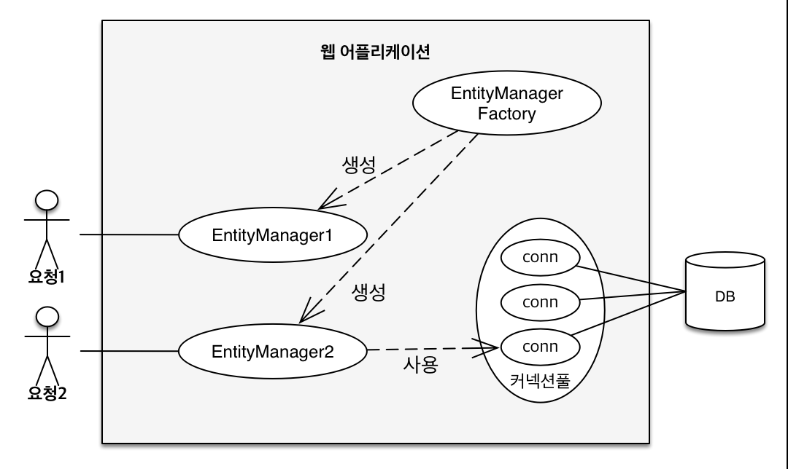
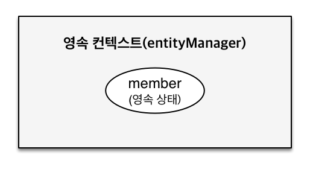
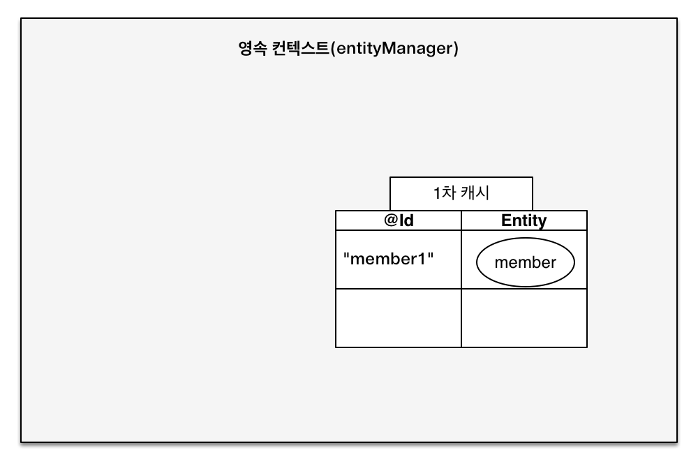
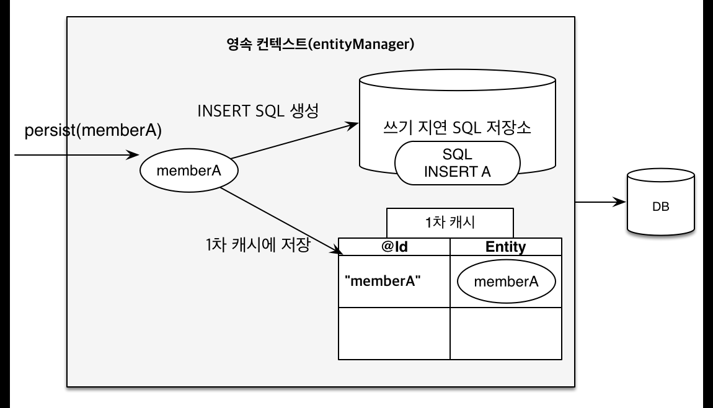

## JPA에서 가장 중요한 2가지

- 객체와 관계형 데이터베이스 매핑하기 Object Relational Mapping

- 영속성 컨텍스트(실제 JPA가 내부에서 어떻게 동작하는가?)

## 엔티티 매니저 팩토리와 엔티티 매니저



- 엔티티 매니저 팩토리를 통해 고객의 요청이 올 때마다 엔티티 매니저 생성

## 영속성 컨텍스트란?

- JPA를 이해하는데 가장 중요한 용어

- 엔티티를 영구 저장하는 환경

- EntityManager.persist(`entity`);

- 사실 db에 저장한다기 보단 엔티티를 영속화 한다는 것

### 영속성 컨텍스트

- 영속성 컨텍스트는 논리적인 개념

- 눈에 보이는게 아니다.

- 엔티티 매니저를 통해 영속성 컨텍스트에 접근한다.

### J2SE 환경

- 엔티티 매니저와 영속성 컨텍스트가 1:1

## 엔티티의 생명주기

- 비영속(new/transient) : 영속성 컨텍스트와 전혀 관계 없는 새로운 상태

- 영속(managed) : 영속성 컨텍스트에 관리되는 상태

- 준영속(detached) : 영속성 컨텍스트에 저장되었다가 분리된 상태

- 삭제(removed) : 삭제된 상태

### 비영속

> member 객체를 생성만하고, entityManager에는 넣지 않음
> JPA랑 전혀 관계가 없음

```java
Member member = new Member();
member.setId("member1");
member.setUsername("회원1");
```

### 영속

```java
EntityManager em = emf.createEntityManager();
em.getTransaction().begin();

//객체를 저장한 상태(영속)
em.persist(member);
```



- persist(member) 자체가 DB에 저장하는 것이 아니다.

```java
//영속 상태 시작
System.out.println("===BEFORE===");
em.persist(member);
System.out.println("===AFTER===");
```

- 이렇게 테스트를 해보면, BEFORE, AFTER사이엔 아무것도 없고, 나중에 insert 하는 것을 확인할 수 있다.

- tx.commit() 하는 시점에 쿼리가 db에 날라가게 된다.

### 준영속, 삭제

```java
em.detach(member);
```

- 회원 엔티티를 영속성 컨텍스트에서 분리한다. 이걸 `준영속 상태`라고 한다.

```java
em.remove(member);
```

- 객체를 삭제한 상태(삭제)

## 영속성 컨텍스트의 이점

> 왜 이런 매커니즘이 필요한가?

- DB와 애플리케이션 사이 중간 계층이 있는 것

- 1차 캐시
  

  - 나중에 조회할 때, 1차 캐시에서 조회를 할 수 있음(db 직접 접근 할 필요 없음)
  - 1차 캐시에 없다면, DB에서 조회, 그 객체를 캐시에 저장해둠.

  - persist(member)을 통해 영속성을 부여했다면, commit() 전까지 db에는 반영되지 않은 상태이다.

  - commit() 전에 em.find()로 해당 member를 검색하면, 검색이 된다.

  - select 문을 사용하지도 않는다.

  - 왜냐하면 DB에 갈 필요 없이 1차 캐시에서 조회하기 때문

  ### 새로운 em 객체를 생성하고 다시 조회하는 케이스

  em.find() 를 두번하게 되면, 처음 find에서는 db에서 가져온다. 이대 select 문 사용

  두번째 find는 select가 출력되지 않는다.

  1차 캐시에 저장이 되어있기 때문에

- 동일성 보장(identity)

  - 자바 컬렉션에서 ==으로 같은 객체 비교하면 똑같음

  - em.find로 찾은게 동일 객체라면, 그 두 객체의 동일성을 보장해준다.

  - 이게 가능한 이유가 1차 캐시

  - 1차 캐시로 반복 가능한 읽기를 db가 아닌 애플리케이션 차원에서 제공해주기 때문

- 트랜잭션을 지원하는 쓰기 지연

  - 엔티티 등록 할 때

  - commit() 하기 전까지 insert 등 SQL을 db에 보내지 않는다.

  - JPA는 그 요청을 쌓아 둔다.
    
    
  - 쓰기 지연 SQL 저장소에 SQL 요청을 쌓아둔다.

  - 1차 캐시에는 member를 쌓아 둔다.

  - commit() 이 들어오는 순간, 쓰기 지연 SQL 저장소에 있는 SQL을 db에 날린다.

  - 모았다가 한번에 DB에 저장하면 얻는 이점 : 최적화, batch 버퍼링을 모아서 write

- 변경 감지

  - 엔티티 수정
  - update를 안해도 db의 값을 변경할 수 있다.

  - 비밀: 영속성 컨텍스트

  - JPA는 db 트랜잭션을 commit 하는 시점에 FLUSH()

  - flush 때 엔티티와 스냅샷을 비교한다

  - 스냅샷 : 내가 값을 읽어온 최초 시점의 모습을 저장해둔 것

  - commit() 되는 시점에 JPA는 현재 엔티티와 스냅샷을 하나하나 비교해본다.

  - 뭔가 바뀌었으면, update 쿼리를 쓰기 지연 sql 저장소에 추가한다.

  - flush() 하면서 db에 sql을 전달한다.
