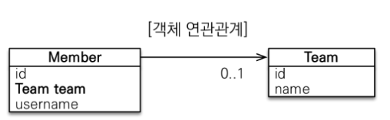

## 목표

- 객체와 테이블 연관관계의 차이를 이해

  - Reference vs Foreign Key

  - 참조 vs 외래 키

- 객체의 참조와 테이블의 외래 키 매핑

- 방향

  - 방향 Direction : 단방향, 양방향

  - 다중성 : 다대일, 일대다, 일대일, 다대다

  - 연관관계의 주인 ( Owner )

## 연관관계가 필요한 이유

- 객체 지향 설계의 목표 = 자율적인 객체들의 협력 공동체 만드는 것

- 객체지향스럽게 설계하는 것 자체를 배워야 한다.

## 예제 시나리오

- 회원과 팀
- 회원은 하나의 팀에만 소속
- 회원과 팀은 다대일 관계이다.

### 객체를 테이블에 맞춰서 모델링한다면

- Member 테이블에는 이 멤버가 어떤 팀에 속하는지 알기 위해 Team 의 id가 필요하다.

- 다시말해, Team_ID(PK)를 외래키로 가지고 있어야 한다.

- 이건 참조가 아닌, 외래키 값을 그대로 가지고 있는 것.

- member 객체를 만들때, teamId를 넣어야 함.

- Team객체의 team.getTeam()을 통해 member.setTeamId()를 해야 한다.

- 이 과정이 객체 지향스럽지가 않다.

#### 조회 시 이슈

- em.find(Member.class, member.getId()) 로 member를 찾아옴

- 이 member가 어떤 팀 소속인지 알기 위해..

- member.getTeamId() // member인스턴스 안에있는 TeamId를 구하고

- em.find(Team.class, TeamID) // 구한 TeamID를 db에서 또 찾는다.

### 객체를 테이블에 맞추어 데이터 중심으로 모델링하면, 협력 관계를 만들 수 없다.

## 단방향 연관관계

- 객체지향스럽게 모델링한다는 건?
  

```java

//Member Class
@ManyToOne
@JoinColumn(name = "Team_ID")
private Team team; // 에러 발생, JPA에게 일대일인지, 다대일인지 알려줘야 함.
// 누가 N인가? member가 many -> @ManyToOne
//@JoinColumn : JPA가 가진 Team_ID 컬럼과 매핑해준다


//Main
//--생성--
Member member = new Member();
member.setUsername("member1");
member.setTeam(team); // 마치 객체가 참조하듯이 관리할 수 있게 됨
em.persist(member);

//--조회--
Member findMember = em.find(Member.class, member.getId());
Team findTeam = findMember.getTeam(); //member 객체 안에 있는 team을 그대로 꺼내올 수 있다.


//--수정--
Team newTeam = em.find(Team.class, 100L);
findMember.setTeam(newTeam); //id==100L인 team을 찾아서, member에 team으로 설정(수정)
```

`JPA에서 쉽게 연관관계를 매핑할 수 있다.`
