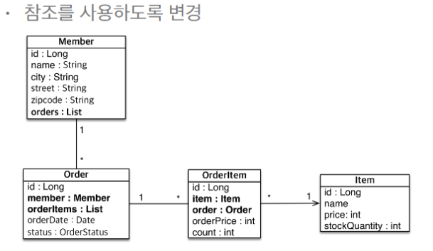

## 연관관계를 반영한 설계



### 가장 중요한건 단방향 매핑 그리고 연관관계의 주인

## 먼저 고민해야 할것

### Member vs Order

- ORDER 에 FK가 있다. 그럼 ORDER의 MEMBER가 연관관계의 주인이다.

```java
//연관관계 매핑
@ManyToOne
@JoinColumn(name = "MEMBER_ID")
private Member member;
```

### ORDER vs ORDER_ITEM

- ORDER_ITEM에 FK가 있다.

### ORDER_ITEM vs ITEM

- ORDER_ITEM에 FK가 있다.

- ORDER_ITEM에 연관관계 설정

```java
@ManyToOne
@JoinColumn(name = "ORDER_ID")
private Order order;

@ManyToOne
@JoinColumn(name = "ITEM_ID")
private Item item;
```

## 양방향에 대한 고민

### MEMBER vs ORDERS

- 대부분의 경우 Member에 List Orders 가 들어있는게 좋은 설계가 아니다.

- 실시간 애플리케이션에서 특정 회원의 주인 내역을 볼 때, ORDER 테이블에 있는 member의 ID를 보고 찾지, member 테이블의 orderList를 별도로 두고 찾을 필요가 없음.

- 회원은 그냥 회원만 가지고 있으면 좋아.

- member가 orders를 가질 필요는 없긴 함.

## 양방향 연관관계를 왜?

- 조회

- 개발 편의

- 실전에서 JPQL을 많이 사용할 텐데, 그 때 저장되어 있는게 있을 때 편해짐.
