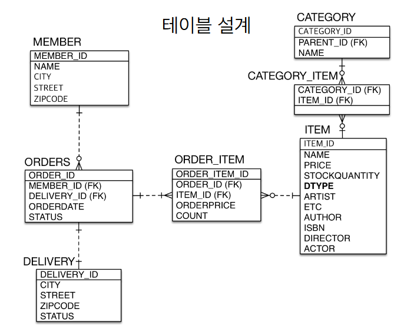

## 상속관계 매핑

## 요구사항이 추가

- 상품의 종류 : 음반, 도서, 영화 + 이후 확장 가능
- 모든 데이터 등록일, 수정일 필수

- 자식 클래스들을 작성한 후 @Entity 지정, extends Item

- Item 클래스에서 @Inheritance(stratehy = InheritanceType.~~)

- 이렇게 2가지 작업만 해도 상속관계가 매핑된다.

- 싱글 테이블 전략 or 조인전략 만 설정해주면 됨

## @MappedSuperclass

- @MappedSuperclass가 붙어있는 BaseEntity 클래스를 모든 클래스가 extends 한다.

- 모든 테이블에 다 들어가는 걸 확인할 수 있음

- JPA의 이벤트를 이용하여 값들을 채울 수 있음(수정일 같은)

## 실전

- 실무에서 상속관계를 쓰나?

- 노가다를 하더라도 item에 많이 때려박고 쓰는게 더 좋을 수도 있음

- 어플리케이션이 커지면 상속관계가 잘 동작하지 않을 수 있고, 테이블을 단순하게 유지해야 한다.

- 처음엔 객체 지향적으로 설계하는 게 맞고, 규모가 커질 수록 테이블을 단순화 하는 방향으로
