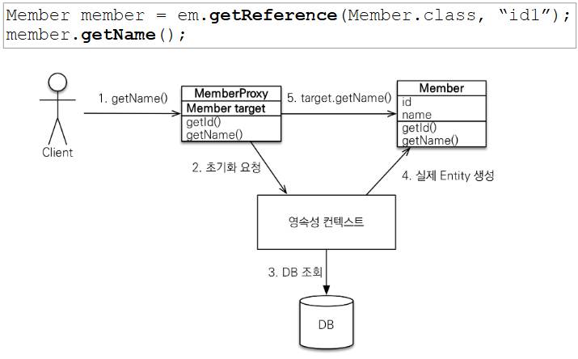

## 프록시란?

- Member를 조회할 때 Team 도 DB에서 같이 조회를 해야 하나?

```java

Member member = em.find(Member.class, 1L);

printMemberAndTeam(member); //member와 속한  team 함께 출력하는 함수


```

- 쿼리가 나갈 때 한번에 다 가져오면 좋겠다.

```java

Member member = em.find(Member.class, 1L);

printMember(member); //member 출력하는 함수

```

- 쿼리가 나갈 때 연관관계가 걸려있다고 한번에 다 가져오면 손해인 듯

- 사용하지 않는데 땡겨온다는 게 최적화 안된 것

- 비즈니스 상황에 따라서 다를 것

- 멤버를 가져온 다음에 항상 Team을 출력하는 비즈니스
- 멤버랑 팀을 같이 쓸일이 없는 비즈니스

## 프록시 기초

- JPA는 em.find() 말고, em.getReference() 로도 값을 가져올 수 있다.

- em.find(member.class, 1L) 을하면, 멤버, 팀 등 한방에 조인해서 가져오는 모습

- em.getReference(member.class, 1L) 만 하면, sql 문(select) 가 안나갔다.

- findMember.getId(), findMember.getUsername()을 하니까 select 문이 나간다.

- getReference를 호출하는 시점에는 쿼리가 안나갔음

- findMember의 정체 : 클래스를 찍어보면 Member 타입이 아니라 Proxy ~ 이다.

## em.getReference()

- 껍데기는 똑같은데 안에는 텅텅 빈 것.

### 프록시 특징

- 실제 엔티티를 상속받아서 만들어짐.

- 실제 클래스와 겉 모양이 같음

- 사용자 입장에서 진짜 객체인지 아닌지 구분이 안됨(할필요 없음)

- 프록시 객체는 실제 객체의 참조(target) 보관

- 프록시 객체를 호출하면 프록시 객체가 실제 객체 값 호출

- em.getReference()는 프록시 객체를만든다. 영속성 컨텍스트에 초기화 요청



- 처음 사용할 때 한번만 초기화 된다.

- 프록시 객체를 초기화할 때, 이게 실제 엔티티로 바뀌는 게 아님

- 그냥 실제 엔티티로 접근 가능해지는 것, 교체되는게 아니다.

- 프록시 객체는 원본 엔티티를 상속받기 때문에, 타입 체크 할 때 주의해야 한다.

- == 으로 타입 비교하면 실패한다. 대신 instanceof를 사용해야

- em.find() 로 받은 것과 em.getReference() 로 받은건 == 비교하면 다르다.

- 영속성 컨텍스트에 찾는 엔티티가 이미 있다면 em.getReference() 해도 실제 엔티티가 반환된다.

- 1. 이미 그걸 영속성 컨텍스트에 올려놨으니까 그대로

- 2. JPA에서는 실제 엔티티든, 프록시 엔티티든 영속성 컨텍스트에서 받아온 그 결과는 항상 일치해야 함

- 영속성 컨텍스트의 도움을 받을 수 없는 경우(준영속 상태), 프록시 초기화 문제

- 영속성 컨텍스트를 detach, close, clear 등 하면, 해당 proxy를 초기화 할 수 없음.

- LazyInitializationException

## 프록시 유틸리티 메서드

- PersistenceUnitUtil.isLoaded(Object entity) : 프록시 인스턴스 초기화 여부 확인

- entity.getClass().getName() .. : 프록시 클래스 확인 방법

- org.hibernate.Hibernate.initialize(entity) : 프록시 강제 초기화 = 값을 실제 db 통해 매핑해놔

-
